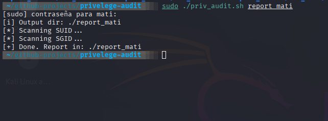
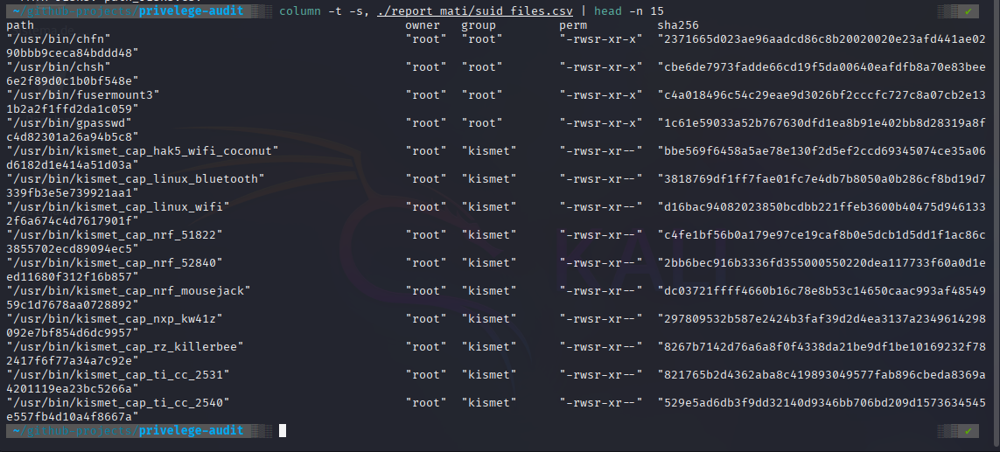

# 🧩 Linux Privilege Audit — SUID/SGID & Capabilities Scanner  
### (Auditor de Privilegios Linux — Escáner de SUID/SGID y Capacidades)

---

## 🧠 Overview / Descripción  

**EN:**  
This Bash tool performs a **Linux privilege escalation audit**.  
It scans for **SUID/SGID binaries**, **file capabilities**, and **risky `$PATH` configurations**, generating detailed reports for system hardening and forensic analysis.  

**ES:**  
Esta herramienta en Bash realiza una **auditoría de escalamiento de privilegios en Linux**.  
Escanea **binarios SUID/SGID**, **capacidades de archivos** y **riesgos en la variable `$PATH`**, generando reportes detallados para reforzar la seguridad del sistema y el análisis forense.

---

## 🚀 Features / Funciones  

| Feature (EN) | Descripción (ES) |
| ------------- | ---------------- |
| Scan and list **SUID** binaries (`-4000`) with metadata and SHA256 hash | Escanea y lista binarios **SUID** (`-4000`) con metadatos y hash SHA256 |
| Scan and list **SGID** binaries (`-2000`) | Escanea y lista binarios **SGID** (`-2000`) |
| Enumerate **file capabilities** (`getcap -r /`) | Enumera **capacidades de archivos** (`getcap -r /`) |
| Detect risky `$PATH` settings (dot `.` or world-writable dirs) | Detecta riesgos en `$PATH` (punto `.` o directorios de escritura global) |
| Generate CSV + Markdown reports for easy review | Genera reportes en CSV + Markdown para revisión rápida |

---

## ⚙️ Execution / Ejecución  

**EN:**  
Clone the repo, give execution permission, and run with `sudo`:  

git clone https://github.com/Matiaslb14/linux-privilege-audit.git
cd linux-privilege-audit
chmod +x priv_audit.sh

Run the audit (default output name is timestamped):

sudo ./priv_audit.sh

Or specify a custom output folder:

sudo ./priv_audit.sh report_mati

**ES:**
Clona el repositorio, otorga permisos de ejecución y ejecuta con sudo:

git clone https://github.com/Matiaslb14/linux-privilege-audit.git
cd linux-privilege-audit
chmod +x priv_audit.sh

Ejecuta la auditoría (el nombre por defecto incluye timestamp):

sudo ./priv_audit.sh

O especifica una carpeta de salida personalizada:

sudo ./priv_audit.sh report_mati

📂 Example Output / Ejemplo de Salida

example-output/
 ├── REPORT.md
 ├── suid_files.csv
 ├── sgid_files.csv
 ├── capabilities.csv
 └── path_risks.csv

🔍 Sample SUID scan (CSV preview)

| path                 | owner | group | perm       | sha256                                         |
| -------------------- | ----- | ----- | ---------- | ---------------------------------------------- |
| /usr/bin/chfn        | root  | root  | -rwsr-xr-x | 2371665d023ae96aadcd86c8b2000200e23adf441ae02  |
| /usr/bin/chsh        | root  | root  | -rwsr-xr-x | cbe6de7973fadde66cd19f5da00640eafdfb8a70e83bee |
| /usr/bin/fusermount3 | root  | root  | -rwsr-xr-x | c4a018496c54c929eae9d032bf2cccf72c7a0cb72e13   |

🔒 Security Recommendations / Recomendaciones de Seguridad

| Recommendation (EN)                         | Recomendación (ES)                                  |
| ------------------------------------------- | --------------------------------------------------- |
| Remove unnecessary **SUID/SGID** bits       | Elimina bits **SUID/SGID** innecesarios             |
| Drop unused **capabilities**                | Quita **capacidades** no utilizadas                 |
| Avoid including `.` in `$PATH`              | Evita incluir `.` en `$PATH`                        |
| Secure or remove world-writable directories | Asegura o elimina directorios con permisos globales |
| Schedule audits periodically                | Programa auditorías de forma periódica              |

Commands (EN / ES):

chmod u-s <file>     # remove SUID / eliminar SUID
chmod g-s <file>     # remove SGID / eliminar SGID
setcap -r <file>     # remove capabilities / quitar capacidades

## 📸 Screenshots / Capturas  

### 🖥️ Running the script / Ejecutando el script  

  

### 📊 SUID audit results (CSV preview) / Resultados del escaneo SUID (vista CSV)  

  

📘 Notes / Notas

**EN:**
This tool is part of the Linux Automation & Security Toolkit Series, focused on Bash scripting for system auditing and privilege hardening.

**ES:**
Esta herramienta forma parte de la serie Linux Automation & Security Toolkit, enfocada en scripting Bash para auditorías del sistema y refuerzo de privilegios.
